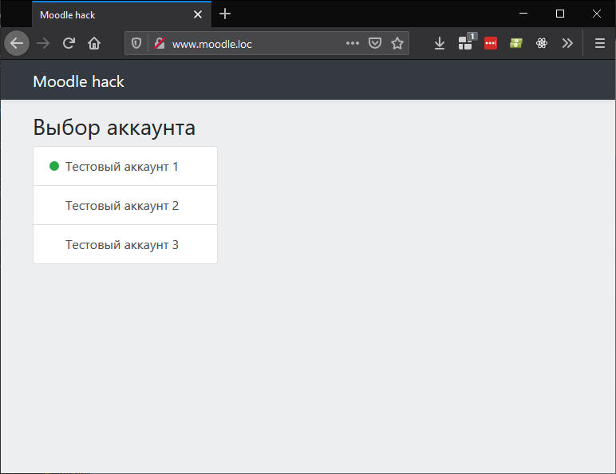

# dahl-moodle-hack

Парсер для системы [moodle.org](https://moodle.org), конкретно реализованного на [moodle.dahluniver.ru](http://moodle.dahluniver.ru).

## Функционал

Интерфейс, в основном, предназначен для просмотра результатов пройденных тестов и сбора всех правильных ответов по тестам из всех аккаунтов.

Основа для всего - класс `App\Moodle`. В файле документирован каждый метод. Класс позволяет получать токен авторизации по логину + паролю, получать список курсов, тем и результатов тестов. Кроме того, имея аккаунты (одногруппников), можно выбрать все доступные правильные ответы на тесты.

## Установка

1. Скачать репозиторий в папку веб-сервера
```
git clone https://github.com/vmrfriz/dahl-moodle-hack.git
cd dahl-moodle-hack
composer install
```

2. Создать таблицы в базе из файла `moodle.sql` в корне проекта
3. Настроить подключение к базе в файле `db.php` в корне проекта
4. Настроить веб-сервер на папку `dahl-moodle-hack`<br>

-----

Например, для apache, добавить в конфиг `conf/extra/httpd-vhosts.conf` настройки типа:
```
<VirtualHost *:80>
    DocumentRoot "C:/xampp/htdocs/dahl-moodle-hack/"
    ServerAdmin admin@localhost
    ServerName moodle.loc
    ServerAlias www.moodle.loc

    <Directory "C:/xampp/htdocs/dahl-moodle-hack/">
       AllowOverride All
       Options Indexes FollowSymLinks
       Require local
    </Directory>

</VirtualHost>
```

В моём случае в `hosts` добавить
```
127.0.0.1 moodle.loc
127.0.0.1 www.moodle.loc
```

------

5. Наполнить в БД таблицу `users` логинами аккаунтами (логин + пароль + имя)
6. Зайти на веб-страницу. В моём случае: http://moodle.loc

## Цели

Основная цель - практика разработки на php, реализация роутера и кэширования. Именно этот проект был реализован только потому, что идея показалась очень интересной. Тестирование велось с трёх аккаунтов, владельцы которых согласились на участие.

## Скриншоты




